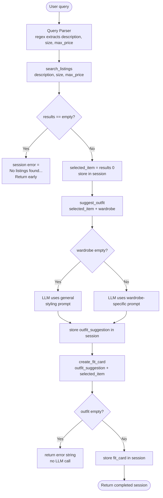

# FitFindr 🛍️

A multi-tool AI agent that helps you find secondhand clothing and figure out how to wear it. You describe what you're looking for, FitFindr searches the listings, suggests outfits using your existing wardrobe, and generates a shareable caption for your find.

---

## Setup

```bash
pip install -r requirements.txt
```

Create a `.env` file in the project root:

```
GROQ_API_KEY=your_key_here
```

Get a free key at [console.groq.com](https://console.groq.com) — no credit card required.

Run the app:

```bash
python app.py
```

Open the URL shown in your terminal (usually `http://localhost:7860`).

---

## Tool Inventory

### `search_listings(description, size, max_price)`

Searches the mock listings dataset for secondhand items matching the user's query.

| Parameter | Type | Description |
|-----------|------|-------------|
| `description` | `str` | Keywords describing the item (e.g. "vintage graphic tee") |
| `size` | `str \| None` | Size to filter by (e.g. "M", "L/XL"). Case-insensitive substring match. `None` skips size filtering. |
| `max_price` | `float \| None` | Maximum price inclusive. `None` skips price filtering. |

**Returns:** `list[dict]` — matching listings sorted by relevance score (highest first). Each dict contains: `id`, `title`, `description`, `category`, `style_tags` (list), `size`, `condition`, `price` (float), `colors` (list), `brand`, `platform`. Returns `[]` if nothing matches — never raises an exception.

**Purpose:** Filters the 40-item mock dataset by hard constraints (price, size), then scores remaining items by keyword overlap across title, description, style_tags, category, colors, and brand. Drops zero-score items and returns the rest sorted by relevance.

---

### `suggest_outfit(new_item, wardrobe)`

Given a thrifted item and the user's wardrobe, generates 1–2 complete outfit combinations.

| Parameter | Type | Description |
|-----------|------|-------------|
| `new_item` | `dict` | A listing dict — the item the user is considering buying |
| `wardrobe` | `dict` | A wardrobe dict with an `items` key containing wardrobe item dicts. May be empty. |

**Returns:** `str` — a non-empty string with outfit suggestions. If the wardrobe is empty, returns general styling advice instead of wardrobe-specific combinations — never crashes or returns an empty string.

**Purpose:** Calls the Groq LLM (llama-3.3-70b-versatile) with the item details and the user's wardrobe formatted as a list. Names specific wardrobe pieces in the suggestions. Switches to a general styling prompt when the wardrobe is empty.

---

### `create_fit_card(outfit, new_item)`

Generates a short, shareable OOTD caption for the thrifted find.

| Parameter | Type | Description |
|-----------|------|-------------|
| `outfit` | `str` | The outfit suggestion string returned by `suggest_outfit()` |
| `new_item` | `dict` | The listing dict for the thrifted item |

**Returns:** `str` — a 2–4 sentence casual caption mentioning the item name, price, and platform once each. If `outfit` is empty or whitespace-only, returns the error string `"Can't generate a fit card without an outfit suggestion."` without calling the LLM.

**Purpose:** Calls the Groq LLM at temperature 0.9 (higher than the other tools) to produce varied, authentic-sounding captions that feel like real OOTD posts rather than product descriptions.

---

## How the Planning Loop Works

The agent runs a linear pipeline with one conditional branch — it does not call all three tools unconditionally.



The real branch point is after `search_listings`: if it returns an empty list, the agent sets `session["error"]` and returns immediately — `suggest_outfit` and `create_fit_card` are never called. This is what makes the planning loop adaptive rather than a fixed sequence.

---

## State Management

All state lives in a single `session` dict initialized at the start of each `run_agent()` call. No tool re-reads the original query or re-prompts the user — everything flows through the session dict.

| Key | Set when | Used by |
|-----|----------|---------|
| `query` | init | reference only |
| `parsed` | after query parsing | `search_listings` call |
| `search_results` | after `search_listings` | branch check |
| `selected_item` | after branch check passes | `suggest_outfit`, `create_fit_card` |
| `wardrobe` | init | `suggest_outfit` |
| `outfit_suggestion` | after `suggest_outfit` | `create_fit_card` |
| `fit_card` | after `create_fit_card` | returned to UI |
| `error` | on error branch | returned to UI |

State passing is explicit: `suggest_outfit` receives `session["selected_item"]` directly, and `create_fit_card` receives `session["outfit_suggestion"]` directly. No global variables, no re-parsing between steps.

---

## Error Handling

| Tool | Failure mode | Agent response |
|------|-------------|----------------|
| `search_listings` | No listings match the query | Sets `session["error"]`: *"No listings found for '[query]' (filtered by size X, under $Y). Try broadening your search — remove the size filter or increase your price range."* Returns session early — `suggest_outfit` is never called. |
| `suggest_outfit` | Wardrobe is empty | LLM prompt switches to general styling advice mode. Returns general outfit ideas instead of wardrobe-specific combinations. Never returns an empty string. |
| `create_fit_card` | `outfit` string is empty or whitespace | Returns immediately: *"Can't generate a fit card without an outfit suggestion."* No LLM call is made. |

**Concrete example from testing:**

Query: `"designer ballgown size XXS under $5"`

The agent returned:
> "No listings found for 'designer ballgown' (filtered by size XXS, under $5). Try broadening your search — remove the size filter or increase your price range."

`session["fit_card"]` was `None` and `session["outfit_suggestion"]` was `None` — confirmed the agent stopped before calling either of the remaining tools.

---

## Spec Reflection

**One way the spec helped:** Writing the planning loop section of `planning.md` before touching `agent.py` made the implementation almost mechanical. The conditional branch on empty `search_results` was already decided on paper — I just translated the spec into code. Without that upfront decision, it would have been easy to accidentally call `suggest_outfit` with an empty item and get a confusing LLM response instead of a clear error.

**One way implementation diverged from the spec:** The query parser needed a fallback for edge cases where stripping price and size phrases left an empty description string — for example, a query like `"under $30"` with no item description. The spec didn't anticipate this. The parser now falls back to the original query in that case rather than passing an empty string to `search_listings`, which would have caused silent failures.

---

## AI Usage

**Instance 1 — `tools.py` implementation:**
I gave Claude the Tool 1, 2, and 3 spec blocks from `planning.md` (inputs, return values, failure modes) plus the wardrobe schema structure. I asked it to implement each function one at a time using `load_listings()` from the data loader and Groq's `llama-3.3-70b-versatile`. Before using the output I verified: does it filter by all three parameters? Does it handle the empty-results case? Does `suggest_outfit` switch prompts when the wardrobe is empty? I revised the scoring logic in `search_listings` to also search across `colors` and `brand` fields, which weren't explicitly in the original spec but improved match quality on color-specific queries.

**Instance 2 — `tests/test_tools.py`:**
I gave Claude the three tool signatures, their return types, and each failure mode from `planning.md`, and asked it to generate a pytest test file with at least one test per failure mode plus edge cases. I reviewed the output and added a `test_create_fit_card_whitespace_outfit` test that wasn't in the initial generation — the original only tested empty string `""`, but whitespace-only `"   "` is a distinct edge case that the guard in `create_fit_card` needs to catch separately. All 10 tests pass.

**Instance 3 — `agent.py` planning loop:**
I gave Claude the full Architecture diagram from `planning.md` plus the Planning Loop and State Management sections. I asked it to implement `run_agent()` following the numbered steps. Before running it I checked: does it branch on empty search results? Does it store each result in the correct session key? Does it not call all three tools unconditionally? I refactored `_parse_query()` into its own helper function after reviewing the output — the original had the regex inline inside `run_agent()`, which made it harder to read and impossible to test in isolation.